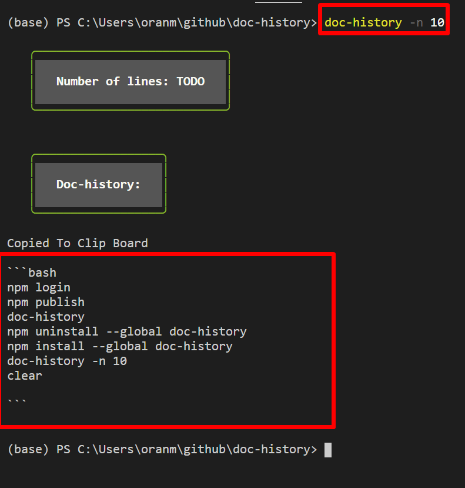

# doc-history
### copies a cleaned up version of your previous commands to the clipboard to use in making documentation easier


-----
[](https://shields.io/) [](http://unlicense.org/).



## Install & run
#### Npm
```bash
npm install --global doc-history
```
<!--  -->

## Usage:
```bash
doc-history -n 10
```

# How it works
### what i would do before doc-history
```bash
>history
1794  code docker-compse.yml 
1795  mv docker-compse.yml docker-compose.yml 
1796  docker-compose up -d
1797  code docker-compose.yml 
1798  docker-compose up -d
1799  docker ps
1800  docker ps -f
1801  docker ps -t
1802  docker ps 
1803  docker ps -t
1804  docker ps 
1805  docker-compose logs
1806  code .env
1807  docker-compose up
1808  docker-compose up -d
1809  docker-compose logs -f
1810  docker-compose up -d
 ```
### remove duplicates
```bash
>history
1797  code docker-compose.yml
1806  code .env
1807  docker-compose up
1808  docker-compose up -d
1809  docker-compose logs -f
 ```
### delete line numbers

```bash
>history
code docker-compose.yml
code .env
docker-compose up
docker-compose up -d
docker-compose logs -f
```
### copy paste into my github markdown page and add markdown styling
```bash
```bash
code docker-compose.yml
code .env
docker-compose up
docker-compose up -d
docker-compose logs -f```
 ```


## doc-history Improves this workflow
```bash
doc-history -n 10
```
### This is copied to your clipboard! 
### now Paste this into markdown doc!
```
# 
```bash
code docker-compose.yml
code .env
docker-compose up
docker-compose up -d
docker-compose logs -f```
 ```


# Development
### how to publish docker image to docker hub
```bash
git clone https://github.com/wisehackermonkey/doc-history.git

cd doc-history
```

## how to build
```bash
npm install --global .
```
## remove locally
```bash
npm uninstall --global doc-history 
list install global deps
npm ls -g --depth=0
```
## how to publish package

```bash
npm login

npm version minor
OR
npm version patch

npm publish --access=public
npm uninstall --global doc-history
npm install --global doc-history
```


------

# Future Additions
- Fuzzy matching  EX:
##### these get remove 
```
powershell.exe /version
powershell.exe \version
```
- wizard that asks about to pick which ones you want to keep
# Contributors
<a href="https://github.com/wisehackermonkey/doc-history/graphs/contributors">
  
</a>

Made with [contributors-img](https://contrib.rocks).


## License

#### This project is licensed under the [](http://unlicense.org/).


